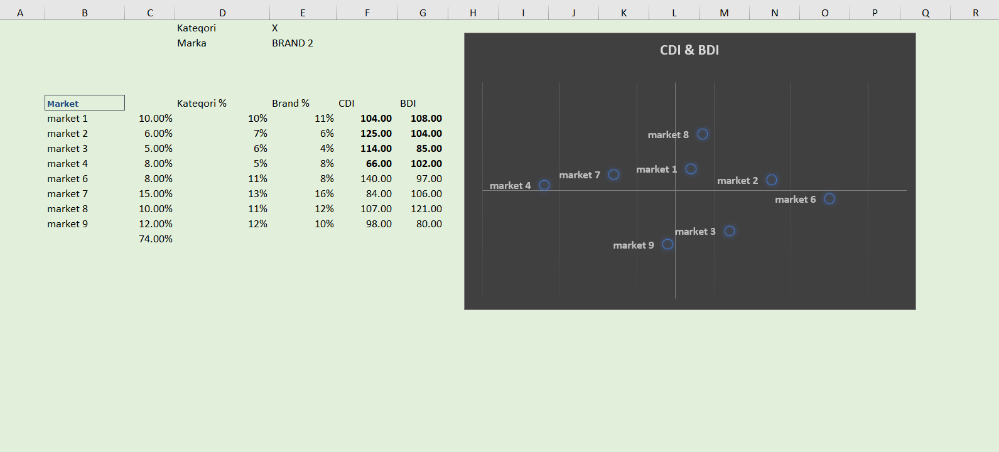

# 📊 BDI & CDI Analysis - Excel Project

This Excel project performs a **BDI (Brand Development Index)** and **CDI (Category Development Index)** analysis for different markets. The project helps identify how well a brand is performing within a specific category across various markets. This analysis is typically used for marketing and sales strategy planning.

---

## 📁 Project Overview

This project includes:

1. **Market Data**: A table with the market share for each market, as well as the **Brand %**, **Category %**, **CDI**, and **BDI** values.
2. **CDI & BDI Chart**: A scatter plot to visualize the performance of each market based on its CDI and BDI.
3. **Key Metrics**: A breakdown of the **Category Share**, **Brand Share**, **CDI**, and **BDI** for each market, with calculations based on market data.

---

## 🔑 Key Features

### 1. **Market Data Breakdown**
The data table shows the following information for each market:

- **Market**: Each market is labeled from Market 1 to Market 9.
- **Category Share (Kategorı %)**: The percentage of the total market that the category occupies.
- **Brand Share (Brand %)**: The percentage of the total market that the brand occupies within the category.
- **CDI (Category Development Index)**: Measures the relative strength of the category in a specific market. A CDI greater than 100 indicates strong category performance in that market.
- **BDI (Brand Development Index)**: Measures the relative strength of the brand in a specific market. A BDI greater than 100 indicates strong brand performance in that market.

### 2. **CDI & BDI Scatter Plot**
The **CDI vs BDI** scatter plot visually shows the relationship between the category and brand performances across different markets:
- **X-axis**: CDI (Category Development Index)
- **Y-axis**: BDI (Brand Development Index)
- Each market is represented by a data point on the graph. Markets with high CDI and BDI values are positioned in the top-right quadrant, indicating strong performance in both category and brand.

### 3. **Interpretation of Results**
- **Markets with High CDI & BDI**: Markets where the brand is performing well both within the category and relative to other markets (e.g., **Market 7** and **Market 8**).
- **Markets with Low CDI & BDI**: Markets where the brand and category are underperforming (e.g., **Market 4**).

### 4. **Usage for Marketing Strategy**
- **High CDI & High BDI Markets**: Focus on these markets for further investment and expansion as both the brand and category are performing well.
- **Low CDI & High BDI Markets**: Focus on improving category performance while maintaining brand strength (e.g., **Market 4**).
- **Low CDI & Low BDI Markets**: Investigate these markets for improvements in both the category and brand performance.

---

## 🧑‍💻 Technologies Used

- **Microsoft Excel** for data analysis, calculations, and visualization.
- **Excel Formulas** for calculating CDI, BDI, and percentages.
- **Charts** (Scatter Plot) for visualizing the relationship between CDI and BDI values.

---

## 🚀 Use Cases

- **Market Performance Analysis**: Evaluate the relative strength of both the category and brand across different markets.
- **Strategic Planning**: Identify high-performing markets to focus marketing efforts on and low-performing markets to investigate and improve.
- **Sales and Marketing Optimization**: Use the insights to optimize resource allocation in markets that need the most attention.

---

## 🧠 Future Enhancements

- **Real-Time Data Integration**: Automatically update the analysis using live market data to keep the insights up to date.
- **Advanced Visualizations**: Add interactive charts or dashboards for better data exploration.
- **Forecasting**: Use historical data to forecast future CDI and BDI values based on trends and market conditions.

---

## 📷 Screenshot of CDI & BDI Chart

> *Ensure the images are correctly linked in your repo directory.*

---

## 🧑‍💼 Author

- **[Abdulsalam Alizade]**  
Data Analyst | Marketing Specialist | Excel Expert

---

